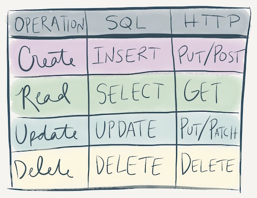

# CRUD => SQL Queries
As you've probably noticed already, you'll see a lot of parallels in programming. We just discussed the different CRUD operations. Now we will map them to some SQL operations. Think about the following SQL operators and guess which CRUD operations they would map to.

- INSERT
- SELECT
- UPDATE
- DELETE

# Same Same, but Different
Think about when we used an http server and the `fs` module to read and write data to and from a file.

Now we are reading and writing to an actual DB.

# Exercise
- Build a schema for students, teachers, and "classes", in g30.
 
- Create a new file called `schema.sql`. Add the code to create the necessary tables shown in the ERD, then follow each step.

## Steps
- INSERT
  - A statement to insert all students has been added for you in `students.sql`
  - Add each teacher to the teachers table.
  - Add at least 5 different classes, and who's teaching them.
- UPDATE
  - Change the number of jobs you've applied to 3.
  - Change the number of jobs a classmate has applied to 5.
  - Change who's teaching one of the classes.
- SELECT
  - Select all students who have applied to at least 1 job.
  - Select all students in one of your classes.
  - Select all students from one of your classes, who've applied to at least 3 jobs.
- DELETE
  - Remove all students who haven't applied to a job yet.
  - Remove all classes you aren't enrolled in.
  - Finally, you're hired! Remove yourself from the students table!
